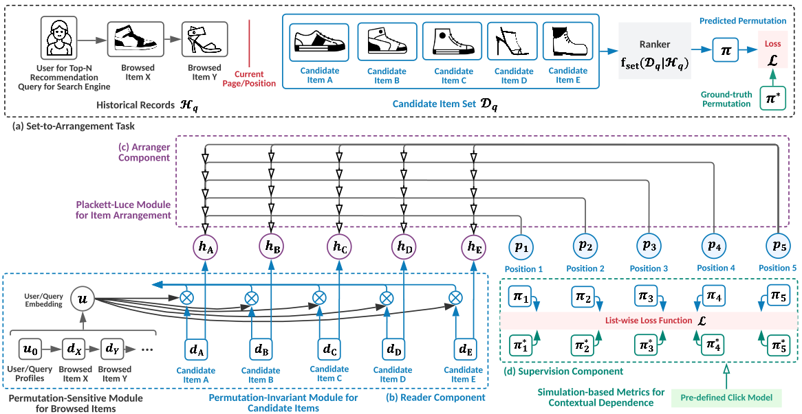

# Set-To-Arrangment Ranking (STARank)
<p align="center">
  
  <br />
  <br />
</p>

This is a `pytorch` implementation STARank model. This is the experiment code in the following work:

> Replace Scoring with Arrangement: A Contextual Set-to-Arrangement Framework for Learning-to-Rank </br>
Jiarui Jin, Xianyu Chen, Weinan Zhang, Mengyue Yang, Yang Wang, Yali Du, Yong Yu, Jun Wang. </br>
[CIKM 2023](https://jinjiarui.github.io/preprints/STARank.pdf)

### Prerequisites
- Python 3.6
- Pytorch 1.8.0

### References
If you find this work helpful in your research, please consider citing the following paper. The bibtex are listed below:
```bibtex
@inproceedings{jin2020efficient,
  title={Replace Scoring with Arrangement: A Contextual Set-to-Arrangement Framework for Learning-to-Rank},
  author={Jin, Jiarui and Chen, Xianyu and Zhang, Weinan and Yang, Mengyue and Wang, Yang and Du, Yali and Yu, Yong and Wang, Jun},
  booktitle={Proceedings of the 32nd ACM International Conference on Information \& Knowledge Management},
  year={2023}
}
```
